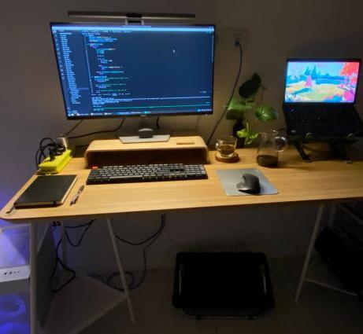

# Work set up

### **Why build PC?**

I'm looking for a machine that is extensible, with upgradeable RAM (preferably up to 32GB), as I foresee myself doing more virtualisation, containerisation, and data analysis.

But finding a laptop with that spec would cost me at least USD 1,500+. Not to mention that machine would likely be heavy to lug around (have to be gamers laptop, etc) as the mid-level enterprise or consumer laptops have mostly removed that upgradeable option and gone all soldered board to keep it light.

I'm also unwiling to pay premium for most laptops as they come in with Windows (yes there are Linux pre-built, but they're very difficult to get these days in Indonesia...), which anyway I'd immediately remove and do a fresh install of Linux, thus likely void my warranty 🤷🏻‍♀️

So I'm thinking, rather than forcing a power set up into a mobile laptop, I can actually fit a PC build AND a decent entry-level laptop (for travel, and also as a back up). After doing some browsing and calculations, I found that I can get a powerful build within the range of USD 695 - 1,100. I did some possible setup combination of CPU, mobo, and RAM, and did an estimate of the total setup cost. At the highest end is the Intel i5 13600K + DDR5 + B760 + CPU cooler. The other option is same CPU, but with DDR4. At the cheapest end is AMD Ryzen 5 5800G + DDR4 + B440 board.

I ended up going with the highest end (DDR5, SSD PCIe gen 4, and latest Intel 13600K) of my three possible build combinations, though it's still on a more budget mobo (B760, not Z790) and cooling (air cooling, since it's just easier to maintain, doesn't heat up my room, and I don't intend to overclock anyway). Was really tempted to consider AMD gen, but it's already 2 gen behind.

Note that (1) I'm not buying a dedicated graphic card, as I don't see myself doing any graphic intensive work, rendering, gaming, etc. (2) this is outside of peripherals like monitor, keyboard, mouse, webcam, headphones etc. This is because I already purchased them for use with my laptop for ergonomic reason, before I was thinking of doing PC build.

### **Pros:**

- Bang for buck. Latest intel i5 13600K (check the benchmark), 32 GB DDR5, 1TB NVMe SSD PCIe 4.0, PSU, CPU cooler, for a total of USD 1,107.29 incl. shipping. And you can go lower than USD 1,000 if you go with DDR4, or with AMD Ryzen 5 5600G.
- Extendability & reusability, environment, can reuse old parts, upgrade. Can use my old HDD.
- A lot of control over customisation

### **Cons:**

- Complex warranties -- all parts have at least 2 year warranties (some even have 5-6), but no ADP
- No official tech support: so you have to anticipate allocating labour and lots of hours troubleshooting, learning, ensuring compatibility, etc

### PC set up:

- CPU: Intel i5 13600K (I’d actually prefer to get 13600 since it would be more power efficient and cheaper, but I can’t wait anymore with my laptop crashes and hardware issues)
- Graphic card: Integrated
- Motherboard: ASRock B760M PG SONIC WiFi 🦔🙈
- Cooler: Noctua NH-L9i-17XX Chromax.Black (air cooler, as I don’t intend to overclock. It’s just easier to maintain, and releases less heat)
- PSU: Be Quiet! Pure Power 11 FM 550W
- Storage: Samsung 980 PRO PCIe 4.0 NVMe SSD 1TB
- RAM: Kingston Fury Besast 2 x 16 GB DDR5 - 5600 MHz
- Casing: Lian Li Lancool 205M Mesh mATX

### Peripherals

- Monitor: Dell S2721HN 27”
- Earphones: Sony WF-1000XM4
- Keyboard: Keychron K5 Ultra-Slim Full Size (need the numpad for data entries)
- Mouse: Logitech MX Master 3S
- Screenbar + webcam: Mibo Screen Bar Webcam USB Monitor Light HD with Microphone — much cheaper than BenQ. The mic doesn’t seem to work well though…

### What am I doing with my old laptop?

I installed Fedora on it, as it's more fast-moving and I'm getting really tired of Ubuntu. [Here is a review](https://youtu.be/D9h_0dnSGWk), and [in case you're wondering if it's for you](https://fedoraproject.org/wiki/Is_Fedora_For_Me), here are [the myths debunked](https://fedoraproject.org/wiki/Fedora_myths). So far it' s been seamless and smooth for me. 

### Useful links

- [https://pcpartpicker.com/](https://pcpartpicker.com/) to check the compatibility of your planned build before you buy them
- [https://www.phoronix.com/](https://www.phoronix.com/) and [OpenBenchmarking.org](http://openbenchmarking.org/)
- [https://www.maketecheasier.com/build-new-pc-for-linux/](https://www.maketecheasier.com/build-new-pc-for-linux/)
- [https://www.makeuseof.com/tag/pros-cons-building-linux-pc/](https://www.makeuseof.com/tag/pros-cons-building-linux-pc/)
- [https://www.zdnet.com/article/look-whats-inside-linus-torvalds-latest-linux-development-pc/](https://www.zdnet.com/article/look-whats-inside-linus-torvalds-latest-linux-development-pc/) — haha just have to mention it
- [Gamers Nexus on YouTube](https://www.youtube.com/@GamersNexus), which my partner highly recommended, but you need to be mindful that oftentimes the needs for gaming PC is quite different from the one for programming and crunching data analysis on Linux. 
